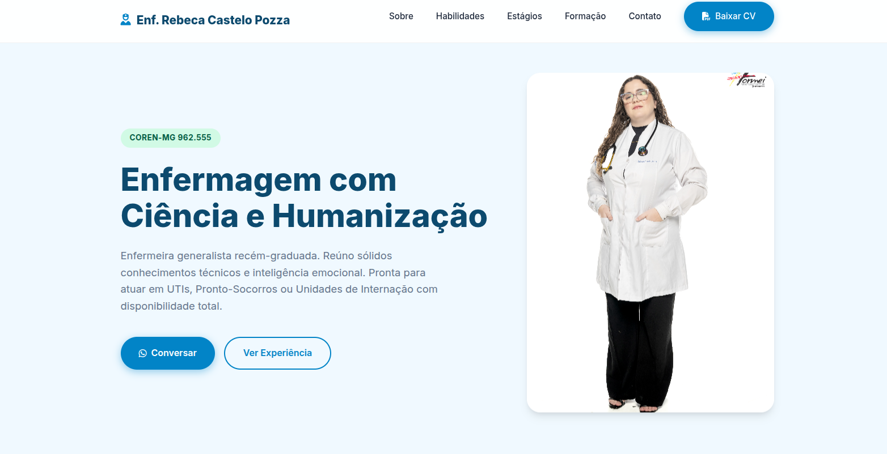

# Portfólio Profissional - Enfermagem 👩‍⚕️

 

Uma Landing Page responsiva e moderna desenvolvida para uma profissional de enfermagem recém-graduada. O objetivo do projeto é apresentar competências técnicas, histórico de estágios e facilitar o contato com recrutadores.

🔗 **[Clique aqui para ver o projeto online](https://portifolio-git-main-mateus-henrique-martins-projects.vercel.app/index.html)**

## 📱 Preview



## 🚀 Funcionalidades

- **Design Responsivo:** Layout adaptável para Celulares, Tablets e Desktops.
- **Timeline Interativa:** Histórico de estágios e experiências profissionais.
- **Seção de Competências:** Cards informativos com ícones intuitivos.
- **Download de Currículo:** Botão direto para baixar o PDF do CV.
- **FAQ (Acordeão):** Seção de perguntas frequentes com animação suave.
- **Contato Direto:** Integração com API do WhatsApp e Mailto.
- **Animações on Scroll:** Elementos surgem suavemente ao rolar a página.

## 🛠️ Tecnologias Utilizadas

O projeto foi construído utilizando tecnologias nativas (Vanilla), garantindo alta performance e carregamento rápido.

- **HTML5:** Estrutura semântica e acessível.
- **CSS3:** Flexbox, Grid Layout, Variáveis CSS e Media Queries.
- **JavaScript (Vanilla):** Manipulação de DOM para menu mobile, acordeão e animações.
- **FontAwesome:** Ícones vetoriais via CDN.
- **Google Fonts:** Tipografia (Inter).

## 📂 Estrutura do Projeto

A organização de pastas segue o padrão de separação de responsabilidades (assets):

```bash
portifoliopessoalsaude/
│
├── index.html              # Arquivo principal
├── README.md               # Documentação
│
└── assets/                 # Recursos estáticos
    ├── style/
    │   └── style.css       # Estilização global e responsividade
    │
    ├── js/
    │   └── script.js       # Lógica do menu, animações e FAQ
    │
    ├── images/             # Fotos de perfil, icons e preview
    │   └── fotopessoa.jpg
    │
    └── documents/          # Arquivos para download
        └── curriculo.pdf
```
## 🔧 Como Executar

Este é um projeto estático, não requer instalação de dependências (como Node.js).

1. **Clone este repositório:**
   ```bash
   git clone [https://github.com/mateus0205/portifoliopessoalsaude.git](https://github.com/mateus0205/portifolioPessoalSaude.git)
    ```
2. **Abra o projeto:**
   Navegue até a pasta e abra o arquivo `index.html` no seu navegador preferido.

> **Dica:** Para desenvolvimento, recomenda-se usar a extensão "Live Server" do VS Code.

## 🎨 Personalização

Para adaptar este projeto para outro profissional:

- **Textos:** Edite o conteúdo diretamente no `index.html`.
- **Cores:** Altere as variáveis `:root` no início do arquivo `assets/style/style.css` para mudar a paleta de cores rapidamente.
- **Imagens:** Substitua a foto em `assets/images/` mantendo as proporções.

## 👨‍💻 Autor

Desenvolvido por **Mateus Henrique Martins**.